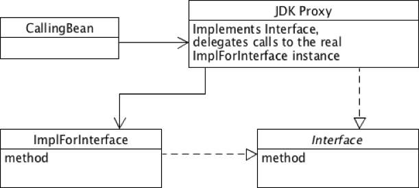
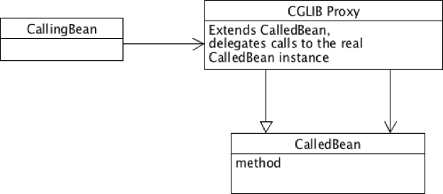
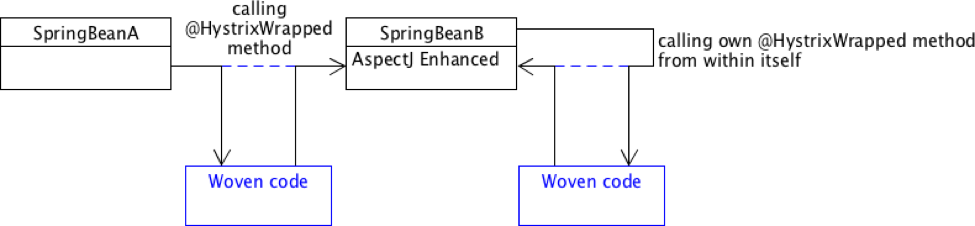

## Spring AOP

```
ㅁ Author: suktae.choi
ㅁ References:
- https://www.credera.com/blog/technology-insights/open-source-technology-insights/aspect-oriented-programming-in-spring-boot-part-2-spring-jdk-proxies-vs-cglib-vs-aspectj/
- https://www.mkyong.com/spring3/spring-aop-aspectj-annotation-example/
- http://www.mkyong.com/spring/spring-aop-examples-advice/
- http://haviyj.tistory.com/33
- https://docs.spring.io/spring/docs/current/spring-framework-reference/html/aop.html
```

### Cores
**Advice** the **Aspect** to **PointCut** target.

- Advice - Inject when
- Aspect - contents
- PointCut - target.

Here is brief example:

```java
@AspectJ
public class DefaultRestAspect {
  @Before(value = "@annotation(repayable) && execution(* com.toy.controller.*.*(..))")
  public void before() {
    // aspect executed before controller
  }

  @AfterReturning(value = "@annotation(repayable) && execution(* com.toy.controller.*.*(..))", returning = "returnVal")
  public void afterReturning(JoinPoint joinPoint, Object returnVal) {
    // aspect executed after controller's response is successfully returned
  }

  @Around(value = "@annotation(repayable) && execution(* com.toy.controller.*.*(..))")
  public Object doBasicProfiling(ProceedingJoinPoint pjp) throws Throwable {
    // @Before
    Object returnVal = pjp.proceed();
    // @AfterReturning
    return returnVal;
  }
}
```

#### PointCut

- execution
- within
- this
- target
- args
- @annotation

#### Advice

- @Before - Before the method execution
- @AfterReturning - After the method returned a result, intercept the returned result as well.
- @AfterThrowing - After the method throws an exception
  - @After (== finally) - After the method is invoked (a.k.a after the afterReturning and/or afterThrowing)
- @Around - Run around the method execution, combine all three advices above.

#### Aspect

The contents what to do.

### Proxy

`Proxy` is wrapping the target class (a.k.a delegate) for adding extra features without modifying it.

Proxy is categorized in two-way:

- Runtime-weaving
- Compile-weaving

Spring's default proxy used runtime-weaving and it has following drawbacks:

- Self-invocation doesn't work around because It will not come through proxy
- Public method only affected
- Method should not be final
  - Proxy override target method to delegate but final keyword can't be make it


#### JVM Dynamic Proxy
- Runtime-weaving
- springAOP default
- Works in `interface`



#### CGLIB Proxy
- Runtime-weaving
- enabled when `proxyTargetClass=true`
- Works in `target class`



#### AspectJ
- Compile-weaving
- JVM loadtime weaving using bytecode instrument
- No limitations



```xml
  <aop:aspectj-autoproxy proxy-target-class="true"/>

  <!-- bean define explicitly or
       using component-scan with <context:include-filter> -->
	<bean id="logAspect" class="com.aspect.LoggingAspect" />
```

```java
@Aspect
public class LoggingAspect {

	@Before("execution(* com.repository.add(..))")
	public void logBefore(JoinPoint joinPoint) {
		System.out.println("before : " + joinPoint.getSignature().getName());
	}
}
```

### AOP vs Interceptor
- Interceptor - postHandle()/afterCompletion are not invoked when **exception thrown in target method**
- AOP - @AfterThrowing/@After/@Around can handle it
