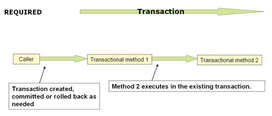
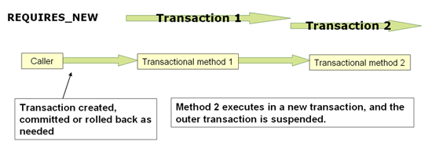

## Transaction

```
ㅁ Author: suktae.choi
ㅁ References:
- http://haviyj.tistory.com/33
- https://blog.outsider.ne.kr/869
- http://lng1982.tistory.com/128
- http://javacan.tistory.com/entry/Handle-DomainEvent-with-Spring-ApplicationEventPublisher-EventListener-TransactionalEventListener
- https://spring.io/blog/2015/02/11/better-application-events-in-spring-framework-4-2
- http://springsource.tistory.com/136
```

### Cores

#### TransactionManager

스프링의 트랜잭션 매니저는 모두 **PlatformTransactionManager** interface 를 구현한다.

대표적인 구현체는 다음과 같다:

**DataSourceTransactionManager**

DataSource (JDBC) 에서 사용하는 매니저이다. 

- MyBatis
- JdbcTemplate

만 사용할 경우 정의한다.

**JpaTransactionManager**

JPA 를 사용한다면, 해당 매니저를 써야한다.

JPA + DataSource (JDBC) API 도 같이 사용가능하다. (더 상위의 개념이니..)

**HibernateTransactionManager**

Hibernate specific TransactionManager.

**JtaTransactionManager**

N 개의 DataSource 를 이용해서 글로벌(외부시스템)/분산(다른DB) 트랜잭션을 관리하기 위해 사용한다. Composite 의 개념

... TBD

#### Programmatic

**TransactionTemplate**

스프링에서 제공하는 template 을 사용하는 방식이다.

transactionManager 를 주입하고, #execute 을 호출해 TransactionCallback#doInTransaction 안에서 실행되는 코드는 동일한 transaction 안에서 수행된다.

```java
@Bean
public TransactionTemplate transactionTemplate() {
  return new TransactionTemplate(transactionManager());
}

@Service
@RequiredArgsConstructor
public class UserServiceImpl implements UserService {
  private final TransactionTemplate transactionTemplate;

  public Object updateUser(UserVO userVo) {
    // non-transactional code here
    
    // -- END
    return transactionTemplate.execute(new TransactionCallback<Object>() {
      // this method is executed in-a-transaction
      public Object doInTransaction(TransactionStatus status) {
        try {
          updateOps();
        } catch (Exception e) { 
          // mark rollback-only
          status.setRollbackOnly();
        }

        return null;
      }
    });
  }
}
```

**PlatformTransactionManager**

직접 관리하는 방식으로

- \#getTransaction
- \#commit
- \#rollback

명시적으로 method 를 호출하며 low-level 에서 트랜잭션을 관리한다.

```java
@Bean
public PlatformTransactionManager transactionManager() {
  JpaTransactionManager transactionManager = new JpaTransactionManager();
  transactionManager.setEntityManagerFactory(entityManagerFactory().getObject());
  return transactionManager;
}

@Service
@RequiredArgsConstructor
public class UserServiceImpl implements UserService {
  private final PlatformTransactionManager transactionManager;

  public Object updateUser(UserVO userVo) {
    // non-transactional code here
    
    // -- END
    TransactionStatus status = transactionManager.getTransaction(new DefaultTransactionDefinition());

    try {
      // CUD operations
    } catch (Exception ex) {
      transactionManager.rollback(status);
    }
    transactionManager.commit(status);
  }
}
```

> Whatever It is not marked rollback-only programmatically, runtimeException is always being rollback by design

#### Propagation

- **REQUIRED** - join existing, create new if no



- **REQUIRES_NEW** - create new always, independent to existing



- NESTED - join existing, dependent to existing
  - Outer can affect nested, nested will not affect outer (e.g. Outer - Critical, Nested - Logging)
- SUPPORTS - join existing, no if no
- MANDATORY - join existing, throw exception if no
- NOT_SUPPORTED - ignore if exist
- NEVER - throw exception if exist

#### Isolation

- **DEFAULT** - DB default
- READ_UNCOMMITTED
- READ_COMMITTED
- REPEATABLE_READ
- SERIALIZABLE

#### ReadOnly

Tx is working on read-only mode. The committed changes will be ignored implicitly.

```java
@Transactional(readOnly = true)
```

#### TimeOut

#### Rollback

Specify exception for rollback conditionally

- rollbackFor
- rollbackForClassName
- noRollbackFor
- noRollbackForClassName

```java
@Transactional(rollbackFor = Exception.class)
```

> RuntimeException (unchecked) can be caught even in try-cache code-level but It is marked **rollback-only** so Tx naver be committed.

### Extras

#### @TransactionalEventListener

ApplicationContext will regist the beans that contains method annotated of `@TransactionEventListener` on bootstrap. The event sent by **ApplicationContext#publishEvent** (that inherits EventPublisher) is held and put backed to the TransactionalEventListener methods.

The examples:

```java
@Component
public class Sender {
	private final ApplicationContext context;
  private final ApplicationEventPublisher publisher;
  
  public void sendByContext(Object msg) {
		// applicationContext inherits eventPublisher
    context.publishEvent(msg);
  }
  
  public void sendByPublisher(Object msg) {
    publisher.publishEvent(msg);
  }
}

@Component
public class Receiver {
  @TransactionalEventListener
  public void sendAfterCommit(Event event) {
		// do something
  }
}
```

### Tips

#### Rollback specific commit while exception thrown

- REQUIRES_NEW 로 설정해서, 다른 작업과 무관한 Transaction 으로 처리한다
- NESTED 로 설정해서, Outer 에 영향을 끼치지 않는 트랜잭션으로 분리 (대신 Outer 은 Nested 에 영향을 끼침)
- @TransactionalEventListener(phase = TransactionPhase.AFTER_ROLLBACK)

### 

