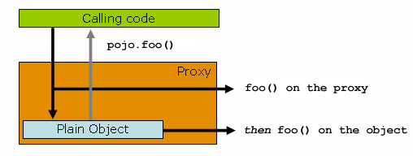
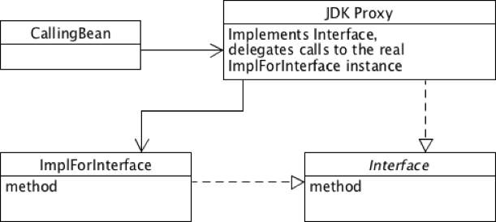

## Proxy

```
ㅁ Author: suktae.choi
ㅁ References:
- https://blog.outsider.ne.kr/851
```

#### Index

- [ProxyFactory](proxy-factory)

#### Cores

`Proxy` is wrapping the target class (a.k.a delegate) for adding extra features without modifying it.

Proxy is categorized in two-way:

- Runtime-weaving
- Compile-weaving

Spring's default proxy used runtime-weaving and it has following drawbacks:

- Self-invocation doesn't work around because It will not come through proxy
- Public method only affected
- Method should not be final
  - Proxy override target method to delegate but final keyword can't be make it



#### JVM Dynamic Proxy

- Runtime-weaving
- springAOP default
- Works in `interface`



#### CGLIB Proxy

- Runtime-weaving
- enabled when `proxyTargetClass=true`
- Works in `target class`


#### AspectJ

- Compile-weaving
- JVM loadtime weaving using bytecode instrument
- No limitations


```xml
  <aop:aspectj-autoproxy proxy-target-class="true"/>

  <!-- bean define explicitly or
       using component-scan with <context:include-filter> -->
	<bean id="logAspect" class="com.aspect.LoggingAspect" />
```

```java
@Aspect
public class LoggingAspect {

	@Before("execution(* com.repository.add(..))")
	public void logBefore(JoinPoint joinPoint) {
		System.out.println("before : " + joinPoint.getSignature().getName());
	}
}
```