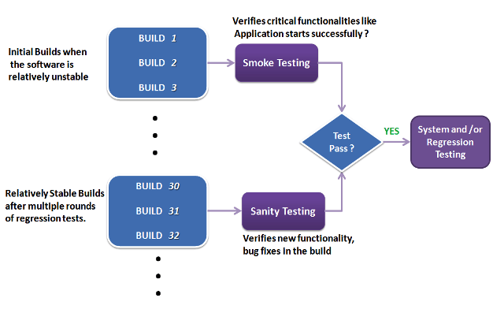

## Smoke Test vs Sanity Test

```
ㅁ Author: suktae.choi
- https://www.guru99.com/smoke-sanity-testing.html
```



### Smoke Test

Verity core (critical) functionalities are stable.

```java
@Override
public void setApplicationContext(ApplicationContext context) {
  // smoke check
  if (context == null) {
    throws new RuntimeException("context must be loaded.");
  }
  
  this.context = context;
}
```

### Sanity Test

Verity new/bugfix functionalities are working well.

Or just confirming that this is intended behavior not insane :)

```java
Type type = getClass().getGenericSuperclass();

// sanity check
if (type instanceof ParameterizedType) { 
 // do some casting   
}
```

