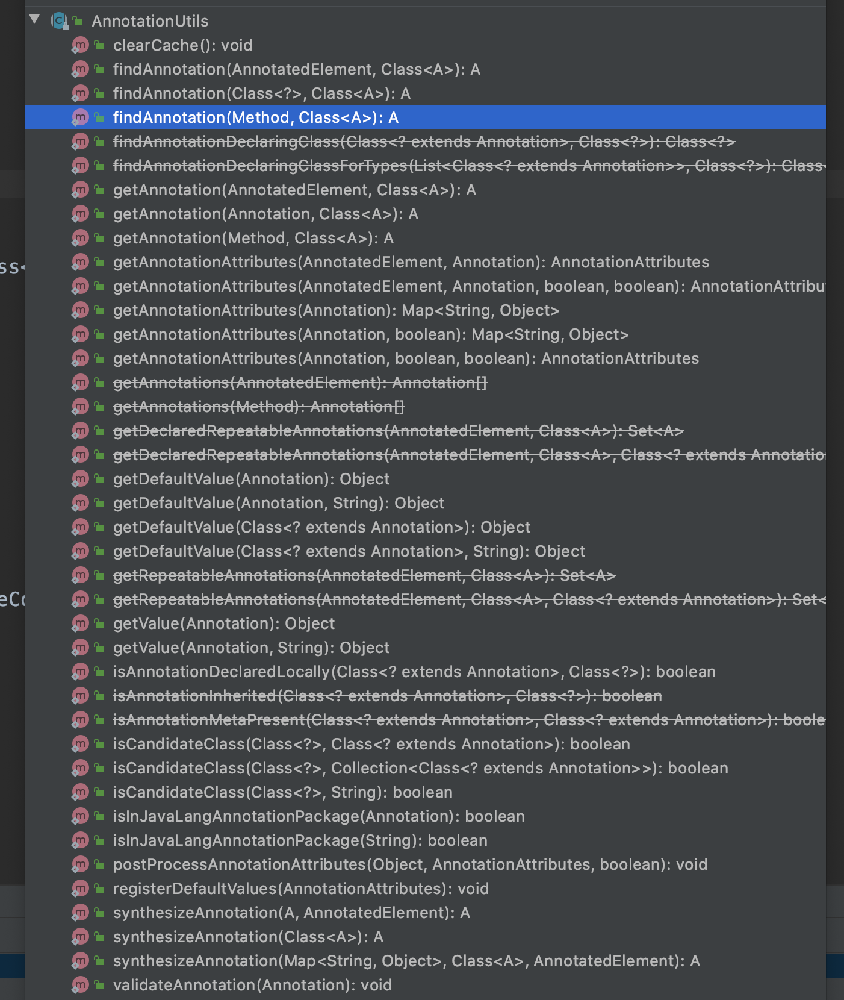

## org.springframework.utils

```
ㅁ Author: suktae.choi
ㅁ References:
- https://spring.io/blog/2017/03/29/spring-tips-the-spring-framework-utils-classes
- https://blog.woniper.net/343
```

## commons.lang3.reflect.MethodUtils

```java
Method[] methods = MethodUtils.getMethodsWithAnnotation(Demo.class, CustomTag.class);	// target methods

for (Method method : methods) {
  MethodUtils.invokeMethod(new Demo(), method.getName());
}
```

## commons.lang3.reflect.FieldUtils

```java
List<Field> fields = FieldUtils.getFieldsListWithAnnotation(Demo.class, CustomTag.class);	// target fields

for (Field field : fields) {
  field.setAccessible(true);
	// 2-ways
  var test1 = (CustomField)ReflectionUtils.getField(field, ftpProperties);
  var test2 = (CustomField)field.get(ftpProperties);
}
```

## ReflectionUtils

특화된 Utils (ex. MethodUtils, FieldUtils) 의 일부 기능을 제공한다.

Exception 처리를 내부에서 해줘서, 심플하게 코드 작성이 필요할 경우 유용하다.

```java
Method method = null; // target method
ReflectionUtils.invokeMethod(method, new Demo());
```

***

## commons.lang3.ClassUtils

```
... TDB
```

## ClassUtils

```
... TDB
```

***

## BeanUtils

Bean instance (POJO 까지 포함해서) 에 대한 PropertyDescriptor 를 가져오는 유틸.

- PropertyDescriptor
  - getReadMethod
  - getWriteMethod
- copyProperties

```java
@Getter
@Setter
static class Demo {
  private String name;
  private Integer number;
}

@Test
public void beanUtilsTest() {
  // from class
  PropertyDescriptor[] descriptors = BeanUtils.getPropertyDescriptors(Demo.class);

  for (PropertyDescriptor descriptor : descriptors) {
    log.info("type={}", descriptor.getName());
    log.info("r/w methods={}, {}", descriptor.getReadMethod(), descriptor.getWriteMethod());
  }  
}

@Test
public void beanUtilsTest2() {
  Demo demo = new Demo();
  // from instance
  BeanWrapper sourceWrapper = PropertyAccessorFactory.forBeanPropertyAccess(demo);
  PropertyDescriptor[] descriptors = sourceWrapper.getPropertyDescriptors();

  for (PropertyDescriptor descriptor : descriptors) {
    log.info("type={}", descriptor.getName());
    log.info("r/w methods={}, {}", descriptor.getReadMethod(), descriptor.getWriteMethod());
  }
}
```

대신 모든 클래스는 Object 를 상속하므로 getClass 까지 항상 property 에 포함되어 있습니다. 그리고 method arguments 로 null 을 전달하고 싶을때는 trick 이 필요합니다.

```java
for (PropertyDescriptor descriptor : descriptors) {
  if (Objects.isNull(descriptor.getWriteMethod())) {
    continue;
  }

  ReflectionUtils.invokeMethod(descriptor.getWriteMethod(), demo, new Object[] {null}); // trick
}
```

> null 을 직접 전달하면 NPE 발생

## AnnotationUtils

여러개의 경로에서 Annotation 을 찾는 utils



## TypeUtils

## ResourceUtils

## PropertiesLoaderUtils

## SystemPropertyUtils

@Value 를 대체할 수 있다. placeHolder 가 포함되어 있으면 resolve 가 같이 처리된다.

```java
@Test
public void systemPropertyUtilsTest() throws Exception {
  // home directory
  String userHome = SystemPropertyUtils.resolvePlaceholders("${user.home}");

  // resolved home directory
  String userHomeText = SystemPropertyUtils.resolvePlaceholders("my home directory is ${user.home}");

  assertThat(userHomeText).isEqualTo("my home directory is " + userHome);
}
```

## ServletRequestUtils

## AopUtils