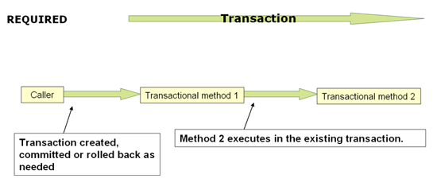

# Transaction

```
@author: suktae.choi
- http://javacan.tistory.com/entry/Handle-DomainEvent-with-Spring-ApplicationEventPublisher-EventListener-TransactionalEventListener
- https://www.marcobehler.com/guides/spring-transaction-management-transactional-in-depth
```

트랜잭션은 아래의 동작을 수행하는것이 기본 원리 입니다:
```java
import java.sql.Connection;

Connection connection = dataSource.getConnection();
Savepoint savePoint = connection.setSavepoint();

try (connection) {
    connection.setAutoCommit(false);
    // ...
    
    connection.commit();
} catch (SQLException e) {
    connection.rollback(savePoint);
}
```

- connection 획득
- savepoint 등록
- auto-commit:false 설정
- commit / rollback 수행
  - rollback 시 savepoint 로 이동

아래에 설명되는 @Transactional 및 TransactionTemplate 은 해당 동작을 스프링에서 wrapping 해서 제공하는 방식입니다

## TransactionManager
### DataSourceTransactionManager
JDBC 에서 사용하는 매니저입니다.

- MyBatis
- JdbcTemplate

### JpaTransactionManager
JPA 를 사용한다면 해당 매니저를 선언합니다.

### JtaTransactionManager
N 개의 DataSource 를 이용해서 글로벌(외부시스템)/분산(다른DB) 트랜잭션을 관리하려면 사용합니다. (Composite 의 개념)

## Propagation
- **REQUIRED**: join existing, create new if no



- **REQUIRES_NEW**: create new always, independent to existing
  - Use physically different transactions. Once NEW has been started, EXIST transaction suspended and doesnt affected despite NEW fails.
  - NEW fails does not affect EXIST transaction
  - EXIST fails does not affect NEW transaction


- NESTED: join existing, dependent to existing
  - Use single physical transaction with multiple `savepoints.` Outer keeps continue despite such inner transaction have been rolled back. This mechanism mapped onto JDBC savepoints, so will only work with DataSourceTransactionManager
  - Nested fails does not affect outer transaction
  - Outer fails does globally rollback even if nested succeed
- SUPPORTS: join existing, no if no
- MANDATORY: join existing, throw exception if no
- NOT_SUPPORTED: ignore if exist
- NEVER: throw exception if exist

## Isolation
- **DEFAULT** - DB default
- READ_UNCOMMITTED
- READ_COMMITTED
- REPEATABLE_READ
- SERIALIZABLE

## @TransactionalEventListener
ApplicationContext will regist the beans that contains method annotated of `@TransactionEventListener` on bootstrap. The event sent by **ApplicationContext#publishEvent** (that inherits EventPublisher) is held and put backed `to the TransactionalEventListener annotated methods.`

The examples:

```java
@Component
public class Sender {
  private final ApplicationContext context;
  private final ApplicationEventPublisher publisher;
  
  public void sendByContext(Object msg) {
		// applicationContext inherits eventPublisher
    context.publishEvent(msg);
  }
  
  public void sendByPublisher(Object msg) {
    publisher.publishEvent(msg);
  }
}

@Component
public class Receiver {
  @TransactionalEventListener
  public void sendAfterCommit(Event event) {
		// do something
  }
}
```

## TransactionTemplate
@Transactional 어노테이션을 선언하거나 직접 transactionTemplate 을 사용 할 수 있습니다.

```java
@Bean
public TransactionTemplate transactionTemplate() {
  return new TransactionTemplate(transactionManager());
}

@Service
@RequiredArgsConstructor
public class UserService {
  private final TransactionTemplate transactionTemplate;

  public Object updateUser(UserVO userVo) {
    // non-transactional code here
    
    // -- END
    return transactionTemplate.execute(new TransactionCallback<Object>() {
      // this method is executed in-a-transaction
      public Object doInTransaction(TransactionStatus status) {
        try {
          updateOps();
        } catch (Exception e) { 
          // mark rollback-only
          status.setRollbackOnly();
        }

        return null;
      }
    });
  }
}
```

## TransactionSynchronizationManager
|                 | isActualTransactionActive | isSynchronizationActive |
| --------------- | ------------------------- | ----------------------- |
| InitTransaction | true                      | true                    |
| Pause           | **false**                 | true                    |
| Resume          | true                      | true                    |
| Finished        | false                     | false                   |