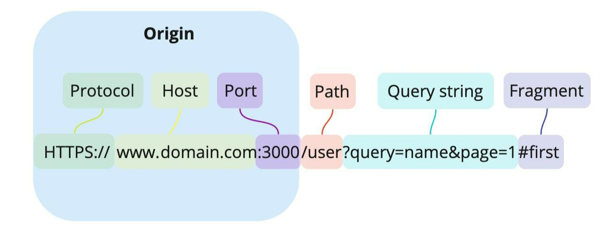
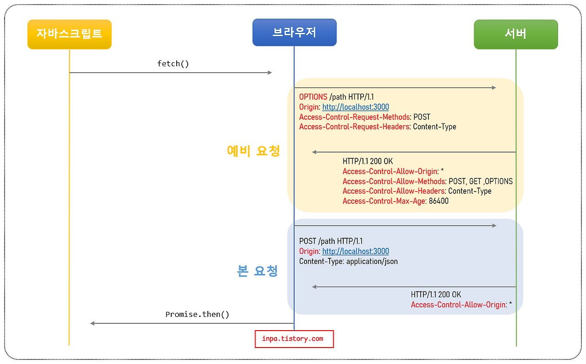
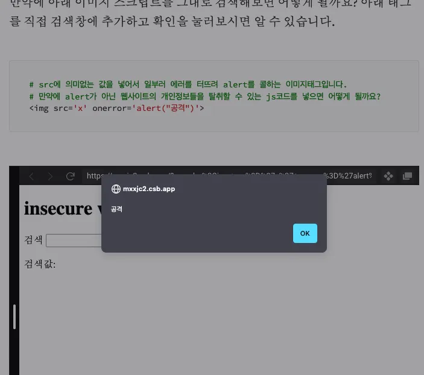
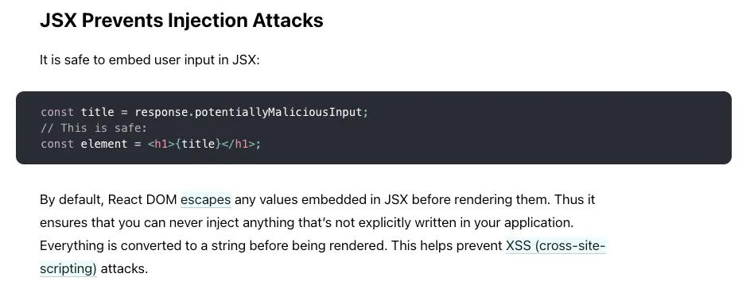

# Web
```
https://developer.mozilla.org
https://ko.javascript.info/
```

## RESTful API
URL에 자원(Resource)을 명시하고, HTTP Method에 행위(Action)를 명시하는 API

### [Method 특징](https://velog.io/@gidskql6671/HTTP-Method%EC%9D%98-%EB%A9%B1%EB%93%B1%EC%84%B1)
HTTP Method 에 대한 멱등성은 동일한 요청을 여러번 보내도 서버 상태가 동일할때를 의미합니다

- `안정성`: 여러번 호출해도 변경되지 않는 특징
  - GET
- `멱등성`: 여러번 호출해도 결과가 동일한 특징
  - GET
  - DELETE
  - PUT
  - `POST(신규생성)/PATCH(특정필드 변경 => ON/OFF 등) 은 구현에 따라 멱등성이 유지 되지 않음`
- 캐시: E-Tag or Last-Modified 등을 이용해 응답이 캐싱되는 특징
  - GET

## [CORS (Cross-Origin Resource Sharing)](https://inpa.tistory.com/entry/WEB-%F0%9F%93%9A-CORS-%F0%9F%92%AF-%EC%A0%95%EB%A6%AC-%ED%95%B4%EA%B2%B0-%EB%B0%A9%EB%B2%95-%F0%9F%91%8F)


Same Origin 은 `프로토로://도메인:포트` 가 동일함을 의미합니다. (동일하지 않다면 Cross Origin)

`브라우져는 기본적으로 Same Origin 에 대한 리소스 호출만을 허용`합니다.
- img, css 는 Cross Origin 을 허용하고 (ex. CDN 도메인)
- script (ex. Fetch/XMLHttpRequest 등 js 에서 API 호출) 는 Same Origin 만 허용합니다

해당 제약을 허용하는 방법이 CORS 이고 아래와 같이 동작합니다:
- (CLIENT) 요청 > `Origin`
- (SERVER) 응답 > `Access-Control-Allow-Origin`
- (CLIENT) 브라우저는 `Origin == Access-Control-Allow-Origin` 비교후 일치하면 성공처리

> 판단의 주체가 `브라우저` 입니다

CORS 를 위해서 전체적인 동작을 설명하면:
- 예비호출
  - (preflight) OPTIONS 로 호출해서 `Access-Control-Allow-*` 헤더값 확인
- 본호출
  - 실제 API 호출
- (이후) Access-Control-Max-Age 에 설정된 시간만큼 예비호출 스킵
  - 서버에서 Max-Age 를 설정하지 않았다면 매 호출마다 preflight 수행



해당 동작을 처리하는 nginx 의 설정은 아래와 같습니다:
```
# preflight
if ($request_method = 'OPTIONS') {
    # allowed origin
    add_header Access-Control-Allow-Origin '*';

    # allowed header
    add_header 'Access-Control-Allow-Headers' '*';

    # allowed method
    add_header 'Access-Control-Allow-Methods' 'GET';

    # preflight request cache-ttl
    add_header 'Access-Control-Max-Age' '86400';

    return 204;
}

# request
add_header Access-Control-Allow-Origin '*' always;
```

## [XSS (Cross-Site Scripting)](https://dj-min43.medium.com/xss-%EA%B3%B5%EA%B2%A9%EC%9D%84-%EC%A7%81%EC%A0%91-%ED%95%B4%EB%B3%B4%EB%A9%B4%EC%84%9C-%EC%95%8C%EC%95%84%EB%B3%B4%EA%B8%B0-c2c1d9baf7ec)
공격자가 화면에 실행할 수 있는 \<script> 를 삽입/실행할 수 있는 취약점 입니다.
- form
- input



```html
<div>
<span>검색값: c/span>
    <span id="search-input-result">
    <script>alert("script 공격");</script>
</span>
</div>
```

아래의 조치로 방어가 필요합니다:
- 입력값의 Escape
  - \<script> -> `&lt;script&gt;`
- 리액트는 JSX 를 렌더링 할때 escape 처리 합니다



## [CSP (Content-Security-Policy)](https://brunch.co.kr/@sangjinkang/43)
스크립트를 실행할 수 있는 Cross Origin 을 지정하는 방식으로, 위에 XSS 방식보다 좀 더 강력한 접근 방식입니다
- XSS 는 실행은 되지만 escape 처리
- CSP 는 실행 자체를 막는 방법

```html
<!-- 서버의 응답헤더 -->
Content-Security-Policy: frame-ancestors 'none';
Content-Security-Policy: default-src 'self' *.naver.com

<!-- 브라우저는 응답헤더에 있는 Origin 을 보고 일치유무 확인 -->
```

Cross Origin 에서 \<iframe> 을 사용시 (ex. \<iframe src="https://youtube.com"/> CSP 헤더를 통해 방지할 수 있습니다

## [PostMessage](https://developer.mozilla.org/en-US/docs/Web/API/Window/postMessage)
Cross-Origin 페이지 끼리 메세지를 주고 받는 방법 입니다.
- 팝업
- iframe

### Sender
메세지와 `targetOrigin` 을 같이 보냅니다.
```tsx
function sendPostMessage(message: string, targetOrigin: string) {
  window.parent.postMessage(message, targetOrigin)
}
```

`*` 으로 지정할 수 있지만 `CSRF 취약점`이 발생합니다.

### Receiver
수신에서도 다시한번 targetOrigin 을 검증합니다
```tsx
window.addEventListener("message", (event) => {
  if (event.origin !== "https://trusted.com") {
      return
  }
  
  console.log("안전한 메시지 수신:", event.data)
})
```

## [CSRF (Cross Site Request Forgery)](https://dev-ino.tistory.com/35)
Cross Origin 에서 의도하지 않은 요청을 실행하는 취약점 입니다
- Cross Site 를 만들고 해당 페이지로 유도
- 유저는 현재 로그인된 자신의 쿠키를 가지고 있다면

```html
<!-- GET 요청이 즉시 실행되도록 img,css 를 이용해서 진입시점에 API 호출 -->


<!-- FORM 을 만들어서 버튼 클릭시 변경 요청이 실행 -->
<form action="https://vulnerable-website.com/password/change" method="POST">
   <input type="hidden" name="password" value="mypassword">
</form>
<script>
  document.forms[0].submit();
</script>
```

의 `가상 페이지에서 의도되지 않은 요청`을 하게 됩니다. 아래의 조치로 방어 할 수 있습니다: 
- `CSRF 토큰 사용 (일반적)`
  - (서버) 사용자의 세션에 고유한 CSRF 토큰을 생성하고 쿠키에 저장
  - (서버) 클라이언트(주로 웹페이지)에게 해당 토큰을 전달 (ex. meta tag, hidden field)
  - (클라이언트) 상태를 변경하는 모든 요청(POST, PUT, DELETE 등)에 해당 토큰을 특정 HTTP 헤더(ex. `X-CSRF-TOKEN`)에 담아 서버로 전송
  - (서버) 요청 헤더의 토큰과 세션 쿠키의 토큰을 비교하여 일치하면 요청을 허용
  - Spring Security 는 기본적으로 CSRF 보호 기능을 활성화하며, 이 패턴을 자동으로 구현해줍니다.
- `SameSite 쿠키 사용`
  - Site 가 다른경우 쿠키 전달을 막아서 방어하는 방안. CSRF 토큰 방식의 보조 수단으로 사용하면 좋습니다.
- `Referrer 체크`
  - 요청의 Referrer 헤더를 확인하여 동일한 도메인에서 온 요청인지 확인합니다 (우회가능)

## Cookies
- Secure
  - `https://` 에서만 전송
- HttpOnly
  - `javascript 에서` Document.cookie 접근 `불가능` (전송만 된다)
- SameSite `CSRF 보호 방법`
  - None Cross-Site 도 전송
  - Lax 링크클릭 등을 통한 이동시 전
  - Strict Same-Origin 로만 전송