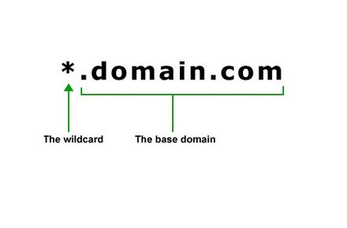
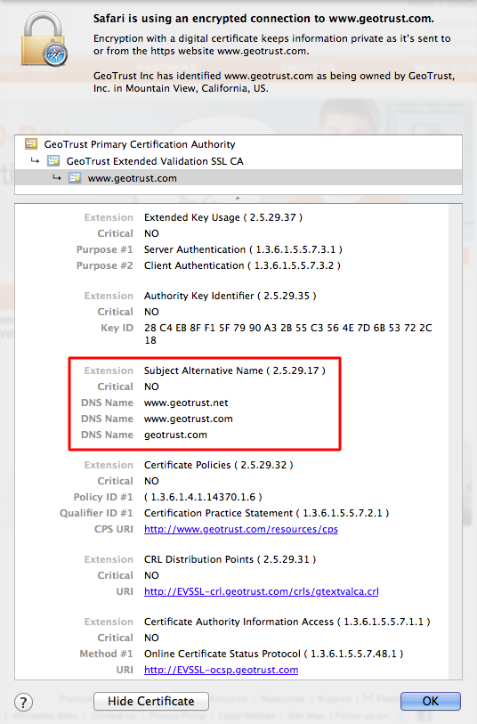

# SAN (Subject Alternative Name)
```
https://www.digicert.com/subject-alternative-name.htm
http://stackoverflow.com/questions/21489525/is-a-wildcard-san-certificate-possible
https://opensrs.com/blog/2012/09/san-and-wildcard-certificates-whats-the-difference/
```

The Subject Alternative Name (SAN), also known as Unified Communications Certificate (UCC), is that allows multiple server or domain/subdomain names using the same secure SSL certificate. It can cover following cases.
- www<span>.</span>google.com
- image.pic.google.com
- \*.google.com
- mail.google.net
- yahoo.com

> Simply wildcard certificate is partial of SAN.

### 1. Wildcard certificate


- `Unlimited` count of single level of subdomains
- Doesn't support different domain
- Doesn't support different server
- Only cover `single-level` of subdomains

Supported domains are following.
```
*.google.com
 : www.google.com
 : mail.google.com
 : calendar.google.com
 : scholar.google.com
```

### 2. SAN certificate


- `Limited` count of single level of subdomains
  - four subdomain/domain are the same price but adding more domains will be extra-charged one-by-one  
- Support different domain
- Support different server
- Cover `multiple-level` of subdomains

Here is supported patterns.
```
DNS Name=outlook.com
DNS Name=*.outlook.com
DNS Name=office365.com
DNS Name=*.office365.com
DNS Name=*.live.com
DNS Name=*.internal.outlook.com
DNS Name=*.outlook.office365.com
DNS Name=outlook.office.com
DNS Name=attachment.outlook.office.net
DNS Name=attachment.outlook.officeppe.net
```
